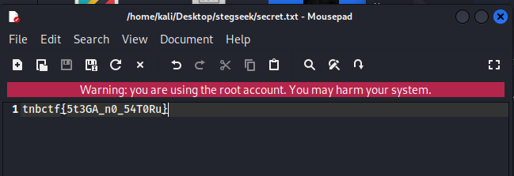

#CTFStegranography
-------------------
How to Solve ?
-------------------

- Install stegseek + steghide with `sudo apt install stegseek_0.6-1.deb`

- Use stegseek command to brutefroce the passphrase `stegseek '/home/kali/Desktop/stegseek/gojo.jpeg' '/home/kali/Desktop/stegseek/rockyou.txt'`

Output
-------------------

- Use steghide command with megumi as passphrase `steghide extract -sf '/home/kali/Desktop/stegseek/gojo.jpeg'`

Output
-------------------

- Flag found
